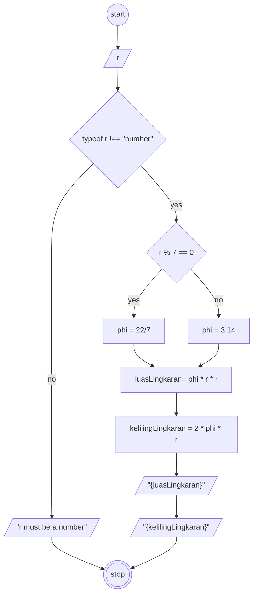

# Algoritma

## Flowchart Keliling dan Luas Lingkaran

algoritma perhitungan luas dan keliling lingkaran

```mermaid
flowchart TD
start@{shape: circle, label:"start" }
a@{shape: lean-r, label: "r" }
cek@{shape: diamond, label: 'typeof r !== "number"'}
err@{ shape: lean-r, label: '"r must be a number"'}
phi1@{shape: rect, label: "phi = 22/7" }
c@{shape: rect, label: "luasLingkaran= phi * r * r" }
d@{shape: rect, label: "kelilingLingkaran = 2 * phi * r"}
e@{shape: lean-r, label: '"{luasLingkaran}"' }
f@{shape: lean-r, label: '"{kelilingLingkaran}"' }
stop@{shape: dbl-circ, label: "stop" }
kondisi@{shape: diamond, label: "r % 7 == 0" }
phi2@{shape: rect, label: "phi = 3.14" }
start-->a
a-->cek

cek-- yes --> kondisi
cek-- no --> err
err--> stop
kondisi--yes-->phi1
kondisi-- no -->phi2
phi1-->c
phi2-->c
c-->d
d-->e
e-->f
f-->stop

```
